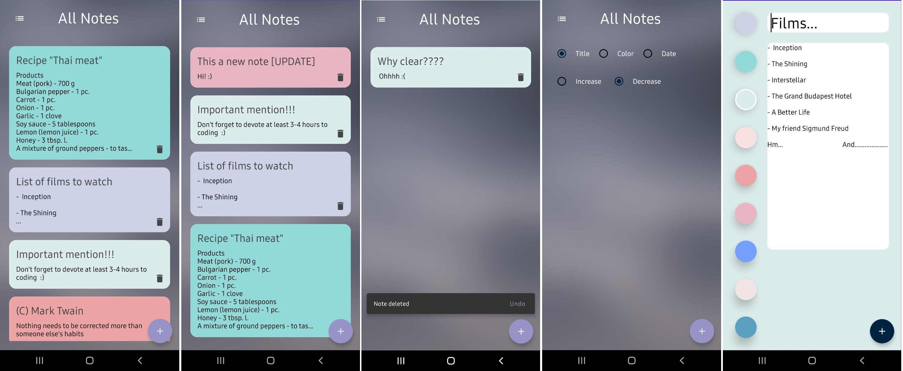

# Sweet Notes
***
Have you been looking for a simple and intuitive note-taking app for a long time? Or maybe you have chosen places to store your thoughts or desires? Then feel free to download our application. Stylish design and fast innovation as a gift :)
***

## Gif and screenshots

*** 

## Libraries and technologies used

* Figma
* Jetpack Compose
* Clean Architecture
* MVVM
* Dagger Hilt
* Kotlin Coroutines
* Kotlin Flow
* SQLite
* Room (CRUD)

***

# Link to download (Play Market)

[CLICK](https://play.google.com/store/apps/details?id=my.rudione.sweetnotes)
